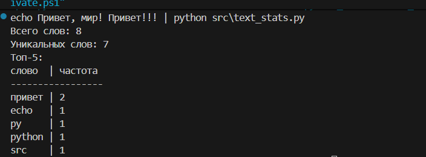
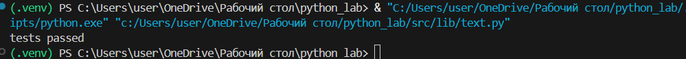

# Лабораторная работа 2

## Задание 1.1

```python
from typing import List, Union

def min_max(nums: List[Union[int, float]]) -> tuple:
    if not nums:
        raise ValueError("Список пуст")
    return (min(nums), max(nums))

def unique_sorted(nums: List[Union[int, float]]) -> List[Union[int, float]]:
    return sorted(set(nums))

def flatten(data: List) -> List[Union[int, float]]:
    flat = []
    for row in data:
        if isinstance(row, (list, tuple)):
            flat.extend(row)
        elif isinstance(row, str):
            raise TypeError("Строка не должна быть строкой строк матрицы")
        else:
            raise TypeError("Неверный тип элемента")
    return flat
print(min_max([3, -1, 5, 5, 0]))
```


## Задание 1.2

```python
from typing import List, Union

def min_max(nums: List[Union[int, float]]) -> tuple:
    if not nums:
        raise ValueError("Список пуст")
    return (min(nums), max(nums))

def unique_sorted(nums: List[Union[int, float]]) -> List[Union[int, float]]:
    return sorted(set(nums))

def flatten(data: List) -> List[Union[int, float]]:
    flat = []
    for row in data:
        if isinstance(row, (list, tuple)):
            flat.extend(row)
        elif isinstance(row, str):
            raise TypeError("Строка не должна быть строкой строк матрицы")
        else:
            raise TypeError("Неверный тип элемента")
    return flat
print(unique_sorted([3, 1, 2, 1, 3]))
```


## Задание 1.3

```python
from typing import List, Union

def min_max(nums: List[Union[int, float]]) -> tuple:
    if not nums:
        raise ValueError("Список пуст")
    return (min(nums), max(nums))

def unique_sorted(nums: List[Union[int, float]]) -> List[Union[int, float]]:
    return sorted(set(nums))

def flatten(data: List) -> List[Union[int, float]]:
    flat = []
    for row in data:
        if isinstance(row, (list, tuple)):
            flat.extend(row)
        elif isinstance(row, str):
            raise TypeError("Строка не должна быть строкой строк матрицы")
        else:
            raise TypeError("Неверный тип элемента")
    return flat
print(flatten([[1, 2], [3, 4]]))
```


## Задание 2.1

```python
from typing import List, Union

Number = Union[int, float]

def check_rectangular(mat: List[List[Number]]):
    if not all(len(row) == len(mat[0]) for row in mat):
        raise ValueError("Матрица рваная")

def transpose(mat: List[List[Number]]) -> List[List[Number]]:
    if not mat:
        return []
    check_rectangular(mat)
    return [[mat[j][i] for j in range(len(mat))] for i in range(len(mat[0]))]

def row_sums(mat: List[List[Number]]) -> List[float]:
    if not mat:
        return []
    check_rectangular(mat)
    return [sum(row) for row in mat]

def col_sums(mat: List[List[Number]]) -> List[float]:
    if not mat:
        return []
    check_rectangular(mat)
    return [sum(row[i] for row in mat) for i in range(len(mat[0]))]
print(transpose([[1, 2, 3]]))
```


## Задание 2.2

```python
from typing import List, Union

Number = Union[int, float]

def check_rectangular(mat: List[List[Number]]):
    if not all(len(row) == len(mat[0]) for row in mat):
        raise ValueError("Матрица рваная")

def transpose(mat: List[List[Number]]) -> List[List[Number]]:
    if not mat:
        return []
    check_rectangular(mat)
    return [[mat[j][i] for j in range(len(mat))] for i in range(len(mat[0]))]

def row_sums(mat: List[List[Number]]) -> List[float]:
    if not mat:
        return []
    check_rectangular(mat)
    return [sum(row) for row in mat]

def col_sums(mat: List[List[Number]]) -> List[float]:
    if not mat:
        return []
    check_rectangular(mat)
    return [sum(row[i] for row in mat) for i in range(len(mat[0]))]
print(row_sums([[1, 2, 3], [4, 5, 6]]))
```


## Задание 2.3

```python
from typing import List, Union

Number = Union[int, float]

def check_rectangular(mat: List[List[Number]]):
    if not all(len(row) == len(mat[0]) for row in mat):
        raise ValueError("Матрица рваная")

def transpose(mat: List[List[Number]]) -> List[List[Number]]:
    if not mat:
        return []
    check_rectangular(mat)
    return [[mat[j][i] for j in range(len(mat))] for i in range(len(mat[0]))]

def row_sums(mat: List[List[Number]]) -> List[float]:
    if not mat:
        return []
    check_rectangular(mat)
    return [sum(row) for row in mat]

def col_sums(mat: List[List[Number]]) -> List[float]:
    if not mat:
        return []
    check_rectangular(mat)
    return [sum(row[i] for row in mat) for i in range(len(mat[0]))]
print(col_sums([[1, 2, 3], [4, 5, 6]]))
```


## Задание 3.1

```python
def format_record(rec: tuple[str, str, float]) -> str:
    fio, group, gpa = rec

    if not fio.strip() or not group.strip() or not isinstance(gpa, (int, float)):
        raise ValueError("Некорректная запись")

    fio_parts = fio.strip().split()
    if len(fio_parts) < 2:
        raise ValueError("Неверное ФИО")

    surname = fio_parts[0].capitalize()
    initials = ''.join(p[0].upper() + '.' for p in fio_parts[1:])
    return f"{surname} {initials}, гр. {group.strip()}, GPA {gpa:.2f}"
print(format_record(("Иванов Иван Иванович", "BIVT-25", 4.6)))
```


## Задание 3.2

```python
def format_record(rec: tuple[str, str, float]) -> str:
    fio, group, gpa = rec

    if not fio.strip() or not group.strip() or not isinstance(gpa, (int, float)):
        raise ValueError("Некорректная запись")

    fio_parts = fio.strip().split()
    if len(fio_parts) < 2:
        raise ValueError("Неверное ФИО")

    surname = fio_parts[0].capitalize()
    initials = ''.join(p[0].upper() + '.' for p in fio_parts[1:])
    return f"{surname} {initials}, гр. {group.strip()}, GPA {gpa:.2f}"
print(format_record(("  сидорова  анна   сергеевна ", "ABB-01", 3.999)))
```


# Лабораторная работа 3

## Задание 1

```python
import sys
from lib.text import normalize, tokenize, count_freq, top_n

TABLE_MODE = True

def print_table(items):
    if not items:
        return
    max_len = max(len(word) for word, _ in items)
    print(f"{'слово'.ljust(max_len)} | частота")
    print("-" * (max_len + 11))
    for word, count in items:
        print(f"{word.ljust(max_len)} | {count}")

def main():
    text = sys.stdin.readline()
    tokens = tokenize(normalize(text))
    freqs = count_freq(tokens)
    top5 = top_n(freqs, 5)

    print(f"Всего слов: {len(tokens)}")
    print(f"Уникальных слов: {len(freqs)}")
    print("Топ-5:")

    if TABLE_MODE:
        print_table(top5)
    else:
        for word, count in top5:
            print(f"{word}:{count}")

if __name__ == "__main__":
    main()
```



## Задание 2

```python
import re
from collections import Counter
from typing import List, Dict, Tuple

def normalize(text: str) -> str:
    text = text.casefold().replace("ё", "е")
    text = re.sub(r"\s+", " ", text.strip())
    return text

def tokenize(text: str) -> List[str]:
    return re.findall(r"\b\w+(?:-\w+)*\b", text)

def count_freq(tokens: List[str]) -> Dict[str, int]:
    return dict(Counter(tokens))

def top_n(freqs: Dict[str, int], n: int) -> List[Tuple[str, int]]:
    return sorted(freqs.items(), key=lambda x: (-x[1], x[0]))[:n]

if __name__ == "__main__":
    assert normalize("ПрИвЕт\nМИр\t") == "привет мир"
    assert normalize("ёжик, Ёлка") == "ежик, елка"
    assert tokenize("привет, мир!") == ["привет", "мир"]
    assert tokenize("по-настоящему круто") == ["по-настоящему", "круто"]
    assert tokenize("2025 год") == ["2025", "год"]
    freq = count_freq(["a", "b", "a", "c", "b", "a"])
    assert freq == {"a": 3, "b": 2, "c": 1}
    assert top_n(freq, 2) == [("a", 3), ("b", 2)]
    freq2 = count_freq(["bb", "aa", "bb", "aa", "cc"])
    assert top_n(freq2, 2) == [("aa", 2), ("bb", 2)]
    print("tests passed")
```



# Лабораторная работа 4

## Задание 1

```python
import csv
from pathlib import Path

# Функция для чтения текста из файла
def read_text(filepath: str, encoding: str = "utf-8") -> str:
    """
    Читает содержимое текстового файла и возвращает строку.
    :param filepath: путь к файлу
    :param encoding: кодировка (по умолчанию UTF-8)
    """
    path = Path(filepath)
    if not path.exists():
        raise FileNotFoundError(f"Файл не найден: {filepath}")

    with open(path, "r", encoding=encoding) as f:
        text = f.read()

    return text


# Функция для записи статистики в CSV-файл
def write_csv(filepath: str, data: list[tuple[str, int]], encoding: str = "utf-8"):
    """
    Записывает данные (слово, частота) в CSV-файл.
    :param filepath: путь к файлу
    :param data: список кортежей (слово, частота)
    """
    path = Path(filepath)
    path.parent.mkdir(parents=True, exist_ok=True)  # создаём директорию, если её нет

    with open(path, "w", encoding=encoding, newline="") as f:
        writer = csv.writer(f, delimiter=";")
        writer.writerow(["Слово", "Частота"])  # заголовки CSV
        for word, count in data:
            writer.writerow([word, count])

    print(f"✅ Отчёт успешно сохранён в {filepath}")


# Тестирование функций
if __name__ == "__main__":
    print("Проверка работы io_txt_csv.py ...")

    # Создадим тестовый файл
    Path("src/lab04/data").mkdir(parents=True, exist_ok=True)
    test_file = Path("src/lab04/data/test.txt")
    test_file.write_text("Пример текста для проверки записи CSV", encoding="utf-8")

    # Прочитаем и выведем текст
    text = read_text(test_file)
    print("Содержимое файла:", text)

    # Проверим запись CSV
    write_csv("src/lab04/data/test_report.csv", [("пример", 2), ("текст", 1)])
```
[](./images/Lab.png)

# Лабораторная работа 6

## Задание 1

```python
import argparse
import sys
from pathlib import Path

# === Добавляем путь, чтобы Python видел lab05 ===
sys.path.append(str(Path(__file__).resolve().parents[1]))

from lab05.json_csv import json_to_csv, csv_to_json
from lab05.csv_xlsx import csv_to_xlsx


def main():
    parser = argparse.ArgumentParser(description="Инструмент для работы с форматами данных")
    subparsers = parser.add_subparsers(dest="command")

    # --- JSON → CSV ---
    json2csv_parser = subparsers.add_parser("json2csv", help="Преобразовать JSON → CSV")
    json2csv_parser.add_argument("--in", dest="input", required=True, help="Входной JSON-файл")
    json2csv_parser.add_argument("--out", dest="output", required=True, help="Выходной CSV-файл")

    # --- CSV → JSON ---
    csv2json_parser = subparsers.add_parser("csv2json", help="Преобразовать CSV → JSON")
    csv2json_parser.add_argument("--in", dest="input", required=True, help="Входной CSV-файл")
    csv2json_parser.add_argument("--out", dest="output", required=True, help="Выходной JSON-файл")

    # --- CSV → XLSX ---
    csv2xlsx_parser = subparsers.add_parser("csv2xlsx", help="Преобразовать CSV → XLSX")
    csv2xlsx_parser.add_argument("--in", dest="input", required=True, help="Входной CSV-файл")
    csv2xlsx_parser.add_argument("--out", dest="output", required=True, help="Выходной XLSX-файл")

    args = parser.parse_args()

    if args.command == "json2csv":
        json_to_csv(args.input, args.output)
    elif args.command == "csv2json":
        csv_to_json(args.input, args.output)
    elif args.command == "csv2xlsx":
        csv_to_xlsx(args.input, args.output)
    else:
        parser.print_help()


if __name__ == "__main__":
    main()
```
[](./images/Lab6.png)


