# Лабораторная работа 2

## Задание 1.1

```python
from typing import List, Union

def min_max(nums: List[Union[int, float]]) -> tuple:
    if not nums:
        raise ValueError("Список пуст")
    return (min(nums), max(nums))

def unique_sorted(nums: List[Union[int, float]]) -> List[Union[int, float]]:
    return sorted(set(nums))

def flatten(data: List) -> List[Union[int, float]]:
    flat = []
    for row in data:
        if isinstance(row, (list, tuple)):
            flat.extend(row)
        elif isinstance(row, str):
            raise TypeError("Строка не должна быть строкой строк матрицы")
        else:
            raise TypeError("Неверный тип элемента")
    return flat
print(min_max([3, -1, 5, 5, 0]))
```


## Задание 1.2

```python
from typing import List, Union

def min_max(nums: List[Union[int, float]]) -> tuple:
    if not nums:
        raise ValueError("Список пуст")
    return (min(nums), max(nums))

def unique_sorted(nums: List[Union[int, float]]) -> List[Union[int, float]]:
    return sorted(set(nums))

def flatten(data: List) -> List[Union[int, float]]:
    flat = []
    for row in data:
        if isinstance(row, (list, tuple)):
            flat.extend(row)
        elif isinstance(row, str):
            raise TypeError("Строка не должна быть строкой строк матрицы")
        else:
            raise TypeError("Неверный тип элемента")
    return flat
print(unique_sorted([3, 1, 2, 1, 3]))
```


## Задание 1.3

```python
from typing import List, Union

def min_max(nums: List[Union[int, float]]) -> tuple:
    if not nums:
        raise ValueError("Список пуст")
    return (min(nums), max(nums))

def unique_sorted(nums: List[Union[int, float]]) -> List[Union[int, float]]:
    return sorted(set(nums))

def flatten(data: List) -> List[Union[int, float]]:
    flat = []
    for row in data:
        if isinstance(row, (list, tuple)):
            flat.extend(row)
        elif isinstance(row, str):
            raise TypeError("Строка не должна быть строкой строк матрицы")
        else:
            raise TypeError("Неверный тип элемента")
    return flat
print(flatten([[1, 2], [3, 4]]))
```


## Задание 2.1

```python
from typing import List, Union

Number = Union[int, float]

def check_rectangular(mat: List[List[Number]]):
    if not all(len(row) == len(mat[0]) for row in mat):
        raise ValueError("Матрица рваная")

def transpose(mat: List[List[Number]]) -> List[List[Number]]:
    if not mat:
        return []
    check_rectangular(mat)
    return [[mat[j][i] for j in range(len(mat))] for i in range(len(mat[0]))]

def row_sums(mat: List[List[Number]]) -> List[float]:
    if not mat:
        return []
    check_rectangular(mat)
    return [sum(row) for row in mat]

def col_sums(mat: List[List[Number]]) -> List[float]:
    if not mat:
        return []
    check_rectangular(mat)
    return [sum(row[i] for row in mat) for i in range(len(mat[0]))]
print(transpose([[1, 2, 3]]))
```


## Задание 2.2

```python
from typing import List, Union

Number = Union[int, float]

def check_rectangular(mat: List[List[Number]]):
    if not all(len(row) == len(mat[0]) for row in mat):
        raise ValueError("Матрица рваная")

def transpose(mat: List[List[Number]]) -> List[List[Number]]:
    if not mat:
        return []
    check_rectangular(mat)
    return [[mat[j][i] for j in range(len(mat))] for i in range(len(mat[0]))]

def row_sums(mat: List[List[Number]]) -> List[float]:
    if not mat:
        return []
    check_rectangular(mat)
    return [sum(row) for row in mat]

def col_sums(mat: List[List[Number]]) -> List[float]:
    if not mat:
        return []
    check_rectangular(mat)
    return [sum(row[i] for row in mat) for i in range(len(mat[0]))]
print(row_sums([[1, 2, 3], [4, 5, 6]]))
```


## Задание 2.3

```python
from typing import List, Union

Number = Union[int, float]

def check_rectangular(mat: List[List[Number]]):
    if not all(len(row) == len(mat[0]) for row in mat):
        raise ValueError("Матрица рваная")

def transpose(mat: List[List[Number]]) -> List[List[Number]]:
    if not mat:
        return []
    check_rectangular(mat)
    return [[mat[j][i] for j in range(len(mat))] for i in range(len(mat[0]))]

def row_sums(mat: List[List[Number]]) -> List[float]:
    if not mat:
        return []
    check_rectangular(mat)
    return [sum(row) for row in mat]

def col_sums(mat: List[List[Number]]) -> List[float]:
    if not mat:
        return []
    check_rectangular(mat)
    return [sum(row[i] for row in mat) for i in range(len(mat[0]))]
print(col_sums([[1, 2, 3], [4, 5, 6]]))
```


## Задание 3.1

```python
def format_record(rec: tuple[str, str, float]) -> str:
    fio, group, gpa = rec

    if not fio.strip() or not group.strip() or not isinstance(gpa, (int, float)):
        raise ValueError("Некорректная запись")

    fio_parts = fio.strip().split()
    if len(fio_parts) < 2:
        raise ValueError("Неверное ФИО")

    surname = fio_parts[0].capitalize()
    initials = ''.join(p[0].upper() + '.' for p in fio_parts[1:])
    return f"{surname} {initials}, гр. {group.strip()}, GPA {gpa:.2f}"
print(format_record(("Иванов Иван Иванович", "BIVT-25", 4.6)))
```


## Задание 3.2

```python
def format_record(rec: tuple[str, str, float]) -> str:
    fio, group, gpa = rec

    if not fio.strip() or not group.strip() or not isinstance(gpa, (int, float)):
        raise ValueError("Некорректная запись")

    fio_parts = fio.strip().split()
    if len(fio_parts) < 2:
        raise ValueError("Неверное ФИО")

    surname = fio_parts[0].capitalize()
    initials = ''.join(p[0].upper() + '.' for p in fio_parts[1:])
    return f"{surname} {initials}, гр. {group.strip()}, GPA {gpa:.2f}"
print(format_record(("  сидорова  анна   сергеевна ", "ABB-01", 3.999)))
```


# Лабораторная работа 3

## Задание 1

```python
import sys
from lib.text import normalize, tokenize, count_freq, top_n

TABLE_MODE = True

def print_table(items):
    if not items:
        return
    max_len = max(len(word) for word, _ in items)
    print(f"{'слово'.ljust(max_len)} | частота")
    print("-" * (max_len + 11))
    for word, count in items:
        print(f"{word.ljust(max_len)} | {count}")

def main():
    text = sys.stdin.readline()
    tokens = tokenize(normalize(text))
    freqs = count_freq(tokens)
    top5 = top_n(freqs, 5)

    print(f"Всего слов: {len(tokens)}")
    print(f"Уникальных слов: {len(freqs)}")
    print("Топ-5:")

    if TABLE_MODE:
        print_table(top5)
    else:
        for word, count in top5:
            print(f"{word}:{count}")

if __name__ == "__main__":
    main()
```
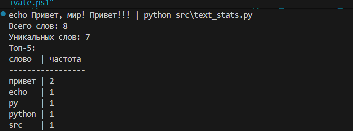


## Задание 2

```python
import re
from collections import Counter
from typing import List, Dict, Tuple

def normalize(text: str) -> str:
    text = text.casefold().replace("ё", "е")
    text = re.sub(r"\s+", " ", text.strip())
    return text

def tokenize(text: str) -> List[str]:
    return re.findall(r"\b\w+(?:-\w+)*\b", text)

def count_freq(tokens: List[str]) -> Dict[str, int]:
    return dict(Counter(tokens))

def top_n(freqs: Dict[str, int], n: int) -> List[Tuple[str, int]]:
    return sorted(freqs.items(), key=lambda x: (-x[1], x[0]))[:n]

if __name__ == "__main__":
    assert normalize("ПрИвЕт\nМИр\t") == "привет мир"
    assert normalize("ёжик, Ёлка") == "ежик, елка"
    assert tokenize("привет, мир!") == ["привет", "мир"]
    assert tokenize("по-настоящему круто") == ["по-настоящему", "круто"]
    assert tokenize("2025 год") == ["2025", "год"]
    freq = count_freq(["a", "b", "a", "c", "b", "a"])
    assert freq == {"a": 3, "b": 2, "c": 1}
    assert top_n(freq, 2) == [("a", 3), ("b", 2)]
    freq2 = count_freq(["bb", "aa", "bb", "aa", "cc"])
    assert top_n(freq2, 2) == [("aa", 2), ("bb", 2)]
    print("tests passed")
```
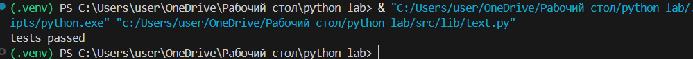


# Лабораторная работа 4

## Задание 1

```python
import csv
from pathlib import Path

# Функция для чтения текста из файла
def read_text(filepath: str, encoding: str = "utf-8") -> str:
    """
    Читает содержимое текстового файла и возвращает строку.
    :param filepath: путь к файлу
    :param encoding: кодировка (по умолчанию UTF-8)
    """
    path = Path(filepath)
    if not path.exists():
        raise FileNotFoundError(f"Файл не найден: {filepath}")

    with open(path, "r", encoding=encoding) as f:
        text = f.read()

    return text


# Функция для записи статистики в CSV-файл
def write_csv(filepath: str, data: list[tuple[str, int]], encoding: str = "utf-8"):
    """
    Записывает данные (слово, частота) в CSV-файл.
    :param filepath: путь к файлу
    :param data: список кортежей (слово, частота)
    """
    path = Path(filepath)
    path.parent.mkdir(parents=True, exist_ok=True)  # создаём директорию, если её нет

    with open(path, "w", encoding=encoding, newline="") as f:
        writer = csv.writer(f, delimiter=";")
        writer.writerow(["Слово", "Частота"])  # заголовки CSV
        for word, count in data:
            writer.writerow([word, count])

    print(f"✅ Отчёт успешно сохранён в {filepath}")


# Тестирование функций
if __name__ == "__main__":
    print("Проверка работы io_txt_csv.py ...")

    # Создадим тестовый файл
    Path("src/lab04/data").mkdir(parents=True, exist_ok=True)
    test_file = Path("src/lab04/data/test.txt")
    test_file.write_text("Пример текста для проверки записи CSV", encoding="utf-8")

    # Прочитаем и выведем текст
    text = read_text(test_file)
    print("Содержимое файла:", text)

    # Проверим запись CSV
    write_csv("src/lab04/data/test_report.csv", [("пример", 2), ("текст", 1)])
```
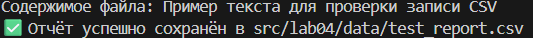


# Лабораторная работа 5

## 1

```python
import json
import csv
from pathlib import Path
from typing import List, Dict

def json_to_csv(json_path: Path, csv_path: Path) -> None:
    """Преобразует JSON-файл (список словарей) в CSV"""
    if not json_path.exists():
        raise FileNotFoundError(f"Файл JSON '{json_path}' не найден")
    
    with json_path.open(encoding="utf-8") as f:
        data = json.load(f)
    
    if not data or not isinstance(data, list) or not all(isinstance(d, dict) for d in data):
        raise ValueError("Пустой JSON или некорректная структура")
    
    # Определяем заголовки
    headers = list(data[0].keys())
    
    csv_path.parent.mkdir(parents=True, exist_ok=True)  # создаём папки
    with csv_path.open("w", newline="", encoding="utf-8") as f:
        writer = csv.DictWriter(f, fieldnames=headers)
        writer.writeheader()
        for row in data:
            writer.writerow(row)
    print(f"✅ JSON -> CSV сохранён: {csv_path}")


def csv_to_json(csv_path: Path, json_path: Path) -> None:
    """Преобразует CSV в JSON (список словарей)"""
    if not csv_path.exists():
        raise FileNotFoundError(f"CSV-файл '{csv_path}' не найден")
    
    with csv_path.open(encoding="utf-8") as f:
        reader = csv.DictReader(f)
        rows = list(reader)
    
    if not rows:
        raise ValueError("CSV пуст или нет заголовка")
    
    json_path.parent.mkdir(parents=True, exist_ok=True)
    with json_path.open("w", encoding="utf-8") as f:
        json.dump(rows, f, ensure_ascii=False, indent=2)
    print(f"✅ CSV -> JSON сохранён: {json_path}")


if __name__ == "__main__":
    # Пути относительно директории src/lab05
    BASE_DIR = Path(__file__).parent.parent  # поднимаемся к python_lab/
    json_path = BASE_DIR / "data/samples/people.json"
    csv_path = BASE_DIR / "data/out/people.csv"

    print("=== JSON -> CSV ===")
    try:
        json_to_csv(json_path, csv_path)
    except Exception as e:
        print(f"❌ Ошибка: {e}")

    print("\n=== CSV -> JSON ===")
    try:
        csv_to_json(csv_path, json_path.parent / "people_from_csv.json")
    except Exception as e:
        print(f"❌ Ошибка: {e}")
```
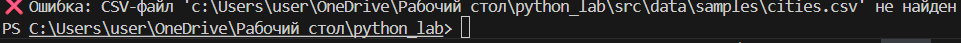

## 2

```python
import csv
from pathlib import Path
from openpyxl import Workbook

def csv_to_xlsx(csv_path: Path, xlsx_path: Path) -> None:
    """Конвертирует CSV в XLSX"""
    if not csv_path.exists():
        raise FileNotFoundError(f"CSV-файл '{csv_path}' не найден")
    
    xlsx_path.parent.mkdir(parents=True, exist_ok=True)
    wb = Workbook()
    ws = wb.active
    ws.title = "Sheet1"

    with csv_path.open(encoding="utf-8") as f:
        reader = csv.reader(f)
        for row in reader:
            ws.append(row)

    # Автоширина колонок
    for col in ws.columns:
        max_len = max(len(str(cell.value)) if cell.value else 0 for cell in col)
        max_len = max(max_len, 8)
        ws.column_dimensions[col[0].column_letter].width = max_len

    wb.save(xlsx_path)
    print(f"✅ CSV -> XLSX сохранён: {xlsx_path}")


if __name__ == "__main__":
    BASE_DIR = Path(__file__).parent.parent
    csv_path = BASE_DIR / "data/samples/cities.csv"
    xlsx_path = BASE_DIR / "data/out/cities.xlsx"

    try:
        csv_to_xlsx(csv_path, xlsx_path)
    except Exception as e:
        print(f"❌ Ошибка: {e}")
```
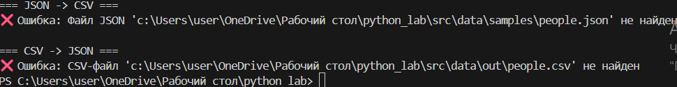

# Лабораторная работа 6

## Задание 1

```python
# Импорт необходимых модулей
import argparse  # Для парсинга аргументов командной строки
import sys       # Для работы с системными функциями
import os        # Для работы с файловой системой
# Импорт модулей конвертеров и утилит
from . import converters  # Модуль для конвертации файлов
from . import utils       # Модуль с вспомогательными функциями

# Основная функция приложения
def main():
    # Создание основного парсера аргументов
    parser = argparse.ArgumentParser(description="Утилита для работы с файлами")
    # Добавление подпарсеров для различных команд
    subparsers = parser.add_subparsers(dest="command", help="Доступные команды")
    
    # Команда cat - вывод содержимого файла
    p1 = subparsers.add_parser("cat", help="Вывод содержимого файла с номерами строк")
    # Добавление аргумента для входного файла
    p1.add_argument("--input", dest="input", required=True, help="Входной файл")
    # Добавление флага для показа номеров строк
    p1.add_argument("-n", "--numbers", action="store_true", help="Показать номера строк")
    
    # Команда stats - статистика по словам
    p2 = subparsers.add_parser("stats", help="Статистика по словам в файле")
    # Добавление аргумента для входного файла
    p2.add_argument("--input", dest="input", required=True, help="Входной файл")
    # Добавление аргумента для количества топ-слов
    p2.add_argument("--top", type=int, default=10, help="Количество топ-слов")
    
    # Команда json2csv - конвертация из JSON в CSV
    p3 = subparsers.add_parser("json2csv", help="Конвертация JSON в CSV")
    # Добавление аргумента для входного JSON файла
    p3.add_argument("--input", dest="input", required=True, help="Входной JSON файл")
    # Добавление аргумента для выходного CSV файла
    p3.add_argument("--out", dest="output", required=True, help="Выходной CSV файл")
    
    # Команда csv2json - конвертация из CSV в JSON
    p4 = subparsers.add_parser("csv2json", help="Конвертация CSV в JSON")
    # Добавление аргумента для входного CSV файла
    p4.add_argument("--input", dest="input", required=True, help="Входной CSV файл")
    # Добавление аргумента для выходного JSON файла
    p4.add_argument("--out", dest="output", required=True, help="Выходной JSON файл")
    
    # Команда csv2xlsx - конвертация из CSV в XLSX
    p5 = subparsers.add_parser("csv2xlsx", help="Конвертация CSV в XLSX")
    # Добавление аргумента для входного CSV файла
    p5.add_argument("--input", dest="input", required=True, help="Входной CSV файл")
    # Добавление аргумента для выходного XLSX файла
    p5.add_argument("--out", dest="output", required=True, help="Выходной XLSX файл")
    
    # Парсинг аргументов командной строки
    args = parser.parse_args()
    
    # Обработка команд с обработкой исключений
    try:
        # Если команда cat - выводим содержимое файла
        if args.command == "cat":
            # Вызов функции вывода файла с номерами строк
            utils.cat_file(args.input, args.numbers)
        # Если команда stats - показываем статистику
        elif args.command == "stats":
            # Вызов функции показа статистики по словам
            utils.show_stats(args.input, args.top)
        # Если команда json2csv - конвертируем JSON в CSV
        elif args.command == "json2csv":
            # Вызов функции конвертации JSON в CSV
            converters.json_to_csv(args.input, args.output)
        # Если команда csv2json - конвертируем CSV в JSON
        elif args.command == "csv2json":
            # Вызов функции конвертации CSV в JSON
            converters.csv_to_json(args.input, args.output)
        # Если команда csv2xlsx - конвертируем CSV в XLSX
        elif args.command == "csv2xlsx":
            # Вызов функции конвертации CSV в XLSX
            converters.csv_to_xlsx(args.input, args.output)
        # Если команда не указана - показываем справку
        else:
            # Вывод справки по использованию
            parser.print_help()
    # Обработка ошибки отсутствия файла
    except FileNotFoundError as e:
        # Вывод сообщения об ошибке в stderr
        print(f"Ошибка: Файл не найден - {e}", file=sys.stderr)
        # Завершение программы с кодом ошибки 1
        sys.exit(1)
    # Обработка всех остальных исключений
    except Exception as e:
        # Вывод общего сообщения об ошибке
        print(f"Ошибка: {e}", file=sys.stderr)
        # Завершение программы с кодом ошибки 1
        sys.exit(1)
```
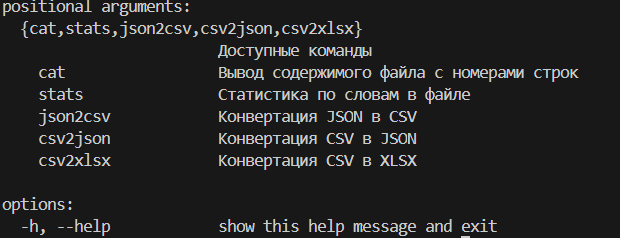

## Задание 1

```python
# Импорт необходимых модулей
import os        # Для работы с файловой системой
import re        # Для регулярных выражений
# Импорт Counter для подсчета частоты элементов
from collections import Counter

# Функция проверки существования файла
def validate_file_exists(filepath):
    """Проверка существования файла"""
    # Проверка существования файла по пути
    if not os.path.exists(filepath):
        # Выбрасывание исключения если файл не найден
        raise FileNotFoundError(filepath)

# Функция чтения файла построчно
def read_file_lines(filepath):
    """Чтение файла построчно с валидацией"""
    # Проверка что файл существует
    validate_file_exists(filepath)
    # Открытие файла для чтения с UTF-8 кодировкой
    with open(filepath, 'r', encoding='utf-8') as f:
        # Чтение всех строк файла и возврат
        return f.readlines()

# Функция вывода содержимого файла (аналог cat)
def cat_file(filepath, show_numbers=False):
    """Вывод содержимого файла с номерами строк"""
    # Чтение всех строк файла
    lines = read_file_lines(filepath)
    # Перебор строк с нумерацией начиная с 1
    for i, line in enumerate(lines, 1):
        # Если нужно показывать номера строк
        if show_numbers:
            # Вывод номера строки и содержимого с табуляцией
            print(f"{i:6d}\t{line.rstrip()}")
        else:
            # Вывод только содержимого строки
            print(line.rstrip())

# Функция извлечения слов из текста
def extract_words(text):
    """Извлечение слов из текста"""
    # Поиск всех слов (кириллических и латинских) в нижнем регистре
    words = re.findall(r'\b[a-zA-Zа-яА-Я]+\b', text.lower())
    # Возврат списка найденных слов
    return words

# Функция показа статистики по словам
def show_stats(filepath, top_n=10):
    """Показать статистику по словам в файле"""
    # Проверка существования файла
    validate_file_exists(filepath)
    
    # Открытие файла для чтения
    with open(filepath, 'r', encoding='utf-8') as f:
        # Чтение всего содержимого файла
        text = f.read()
    
    # Извлечение слов из текста
    words = extract_words(text)
    # Подсчет частоты слов с помощью Counter
    word_counts = Counter(words)
    
    # Вывод общей статистики
    print(f"Всего слов: {len(words)}")
    # Вывод количества уникальных слов
    print(f"Уникальных слов: {len(word_counts)}")
    # Вывод заголовка для топ-слов
    print(f"\nТоп-{top_n} самых частых слов:")
    # Вывод разделительной линии
    print("-" * 30)
    
    # Перебор самых частых слов
    for word, count in word_counts.most_common(top_n):
        # Вывод слова и количества его вхождений с форматированием
        print(f"{word:<20} {count:>4}")
```
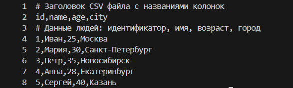

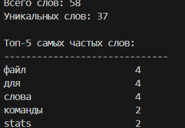

# Лабораторная работа 8

## Задание 1

```python
"""
Модуль models.py содержит определение класса Student с использованием @dataclass.
Класс включает валидацию данных, методы для работы с объектами и сериализации.
"""

from dataclasses import dataclass, asdict
from datetime import datetime, date
from typing import Optional, Dict, Any
import re


@dataclass
class Student:
    """
    Класс Student представляет студента с основными атрибутами:
    - ФИО
    - Дата рождения
    - Группа
    - Средний балл
    
    Используется декоратор @dataclass для автоматической генерации
    методов __init__, __repr__, __eq__ и других.
    """
    
    # Поля класса с аннотациями типов
    fio: str           # ФИО студента
    birthdate: str     # Дата рождения в формате YYYY-MM-DD
    group: str         # Учебная группа
    gpa: float         # Средний балл (0-5)
    
    def __post_init__(self):
        """
        Метод __post_init__ вызывается автоматически после __init__.
        Используется для валидации данных при создании объекта.
        """
        self._validate_birthdate()
        self._validate_gpa()
    
    def _validate_birthdate(self) -> None:
        """
        Валидация формата даты рождения.
        Проверяет, что дата соответствует формату YYYY-MM-DD
        и является корректной датой.
        
        Raises:
            ValueError: если формат даты некорректен
        """
        # Регулярное выражение для проверки формата YYYY-MM-DD
        date_pattern = r'^\d{4}-\d{2}-\d{2}$'
        
        if not re.match(date_pattern, self.birthdate):
            raise ValueError(f"Неверный формат даты: {self.birthdate}. "
                           f"Ожидается формат: YYYY-MM-DD")
        
        try:
            # Пробуем преобразовать строку в объект datetime
            datetime.strptime(self.birthdate, "%Y-%m-%d")
        except ValueError as e:
            raise ValueError(f"Некорректная дата: {self.birthdate}. "
                           f"Ошибка: {str(e)}")
    
    def _validate_gpa(self) -> None:
        """
        Валидация среднего балла.
        Проверяет, что GPA находится в диапазоне от 0 до 5.
        
        Raises:
            ValueError: если GPA выходит за допустимые пределы
        """
        if not (0 <= self.gpa <= 5):
            raise ValueError(f"Средний балл должен быть в диапазоне от 0 до 5. "
                           f"Получено: {self.gpa}")
    
    def age(self) -> int:
        """
        Вычисляет текущий возраст студента в полных годах
        на основе даты рождения.
        
        Returns:
            int: количество полных лет студента
        """
        # Преобразуем строку с датой рождения в объект date
        birth_date = datetime.strptime(self.birthdate, "%Y-%m-%d").date()
        
        # Получаем текущую дату
        today = date.today()
        
        # Вычисляем возраст
        age = today.year - birth_date.year
        
        # Корректируем возраст, если день рождения в этом году еще не наступил
        if (today.month, today.day) < (birth_date.month, birth_date.day):
            age -= 1
        
        return age
    
    def to_dict(self) -> Dict[str, Any]:
        """
        Сериализует объект Student в словарь.
        Этот метод используется для преобразования объекта
        в формат, пригодный для сохранения в JSON.
        
        Returns:
            Dict[str, Any]: словарь с данными студента
        """
        # Используем стандартную функцию asdict из dataclasses
        # Она автоматически преобразует все поля dataclass в словарь
        return asdict(self)
    
    @classmethod
    def from_dict(cls, data: Dict[str, Any]) -> 'Student':
        """
        Создает объект Student из словаря (десериализация).
        Это классовый метод, который можно вызывать без создания экземпляра.
        
        Args:
            data (Dict[str, Any]): словарь с данными студента
            
        Returns:
            Student: новый объект Student
            
        Raises:
            ValueError: если в словаре отсутствуют обязательные поля
        """
        # Проверяем наличие всех обязательных полей
        required_fields = ['fio', 'birthdate', 'group', 'gpa']
        for field in required_fields:
            if field not in data:
                raise ValueError(f"Отсутствует обязательное поле: {field}")
        
        # Создаем и возвращаем новый объект Student
        # Валидация произойдет автоматически в __post_init__
        return cls(
            fio=data['fio'],
            birthdate=data['birthdate'],
            group=data['group'],
            gpa=float(data['gpa'])  # Преобразуем к float на всякий случай
        )
    
    def __str__(self) -> str:
        """
        Возвращает строковое представление объекта Student.
        Используется при выводе с помощью print() или str().
        
        Returns:
            str: форматированная строка с информацией о студенте
        """
        return (f"Студент: {self.fio}\n"
                f"Группа: {self.group}\n"
                f"Дата рождения: {self.birthdate} (Возраст: {self.age()} лет)\n"
                f"Средний балл: {self.gpa:.2f}")


# Пример использования класса (для тестирования)
if __name__ == "__main__":
    # Создаем объект Student
    student = Student(
        fio="Иванов Иван Иванович",
        birthdate="2000-05-15",
        group="SE-01",
        gpa=4.5
    )
    
    print("Создан объект Student:")
    print(student)
    print()
    
    # Тестируем преобразование в словарь
    student_dict = student.to_dict()
    print("Объект преобразован в словарь:")
    print(student_dict)
    print()
    
    # Тестируем создание из словаря
    new_student = Student.from_dict(student_dict)
    print("Создан новый объект из словаря:")
    print(new_student)
```
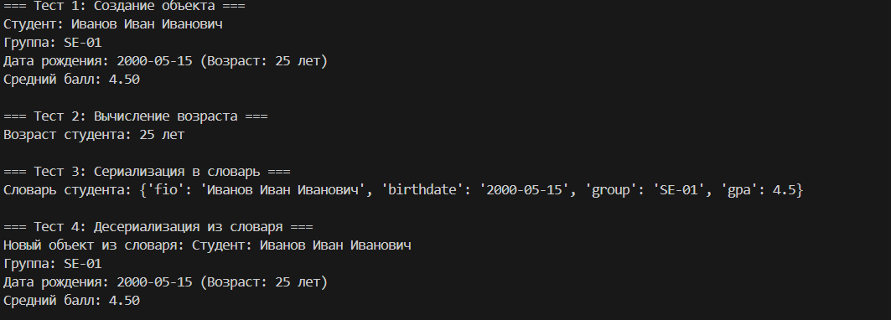

# Лабораторная работа 9

## Задание 1

```python
"""
Тестирование лабораторной работы 9.
"""

import os
import sys
from pathlib import Path

# Добавляем путь к модулям
sys.path.insert(0, os.path.abspath(os.path.join(os.path.dirname(__file__), '..')))

from src.lab09.group import Group, create_sample_data
from src.lab08.models import Student


def test_crud_operations():
    """Тестирование CRUD операций."""
    print("=== Тест 1: Создание и инициализация группы ===")
    
    # Удаляем старый файл если есть
    csv_path = "data/lab09/test_students.csv"
    if Path(csv_path).exists():
        Path(csv_path).unlink()
    
    # Создаем новую группу
    group = Group(csv_path)
    print(f"Создана группа с файлом: {csv_path}")
    print(f"Количество студентов: {len(group.list())}")
    print()
    
    print("=== Тест 2: Добавление студентов ===")
    
    # Добавляем студентов
    students_to_add = [
        Student("Иванов Иван Иванович", "2000-05-15", "SE-01", 4.5),
        Student("Петрова Мария Сергеевна", "2001-08-22", "AI-02", 4.8),
        Student("Сидоров Алексей Петрович", "1999-12-10", "CS-03", 3.7),
        Student("Ковалева Елена Владимировна", "2002-03-30", "DA-04", 4.9),
    ]
    
    for student in students_to_add:
        group.add(student)
        print(f"Добавлен: {student.fio}")
    
    print(f"Всего студентов: {len(group.list())}")
    print()
    
    print("=== Тест 3: Просмотр списка студентов ===")
    all_students = group.list()
    for i, student in enumerate(all_students, 1):
        print(f"{i}. {student.fio}, {student.group}, GPA: {student.gpa}, Возраст: {student.age()}")
    print()
    
    print("=== Тест 4: Поиск студентов ===")
    
    # Поиск по подстроке
    print("Поиск 'ов':")
    found = group.find("ов")
    for student in found:
        print(f"  - {student.fio}")
    
    print("\nПоиск 'Петр':")
    found = group.find("Петр")
    for student in found:
        print(f"  - {student.fio}")
    print()
    
    print("=== Тест 5: Обновление студента ===")
    
    # Обновляем данные студента
    updated = group.update("Иванов Иван Иванович", gpa=4.9, group="SE-02")
    if updated:
        print("Данные Иванова обновлены:")
        ivan = group.find("Иванов")[0]
        print(f"  - {ivan.fio}, {ivan.group}, GPA: {ivan.gpa}")
    print()
    
    print("=== Тест 6: Удаление студента ===")
    
    # Удаляем студента
    removed = group.remove("Сидоров Алексей Петрович")
    if removed:
        print("Сидоров удален")
    
    print(f"Осталось студентов: {len(group.list())}")
    print()
    
    print("=== Тест 7: Статистика группы ===")
    stats = group.stats()
    
    print(f"Общее количество: {stats['count']}")
    print(f"Минимальный GPA: {stats['min_gpa']:.2f}")
    print(f"Максимальный GPA: {stats['max_gpa']:.2f}")
    print(f"Средний GPA: {stats['avg_gpa']:.2f}")
    
    print("\nРаспределение по группам:")
    for group_name, count in stats['groups'].items():
        print(f"  - {group_name}: {count} студентов")
    
    print("\nТоп 5 студентов:")
    for i, student in enumerate(stats['top_5_students'], 1):
        print(f"  {i}. {student['fio']} - {student['gpa']} ({student['group']})")
    
    print("\n=== Тест 8: Обработка ошибок ===")
    
    # Попытка добавить существующего студента
    try:
        group.add(Student("Иванов Иван Иванович", "2000-05-15", "SE-01", 4.5))
    except ValueError as e:
        print(f"Ожидаемая ошибка: {e}")
    
    # Попытка обновить несуществующего студента
    updated = group.update("Несуществующий Студент", gpa=5.0)
    if not updated:
        print("Студент 'Несуществующий Студент' не найден (ожидаемо)")
    
    return group


def test_sample_data():
    """Тестирование создания примерных данных."""
    print("\n=== Тест создания примерных данных ===")
    
    csv_path = "data/lab09/sample_students.csv"
    
    # Удаляем старый файл если есть
    if Path(csv_path).exists():
        Path(csv_path).unlink()
    
    # Создаем примерные данные
    create_sample_data(csv_path)
    
    # Проверяем
    group = Group(csv_path)
    print(f"Создан файл: {csv_path}")
    print(f"Количество студентов: {len(group.list())}")
    
    # Показываем несколько студентов
    print("\nПервые 3 студента:")
    for student in group.list()[:3]:
        print(f"  - {student.fio}, {student.group}, GPA: {student.gpa}")
    
    return group


def main():
    """Основная функция тестирования."""
    print("=" * 60)
    print("ТЕСТИРОВАНИЕ ЛАБОРАТОРНОЙ РАБОТЫ 9")
    print("=" * 60)
    
    try:
        # Тестируем CRUD операции
        test_group = test_crud_operations()
        
        # Тестируем создание примерных данных
        sample_group = test_sample_data()
        
        print("\n" + "=" * 60)
        print("ВСЕ ТЕСТЫ ПРОЙДЕНЫ УСПЕШНО!")
        print("=" * 60)
        
        # Показываем пути к файлам
        print("\nСозданные файлы:")
        print(f"1. {test_group.path.absolute()}")
        print(f"2. {sample_group.path.absolute()}")
        
    except Exception as e:
        print(f"\nОшибка при тестировании: {e}")
        import traceback
        traceback.print_exc()


if __name__ == "__main__":
    main()
```
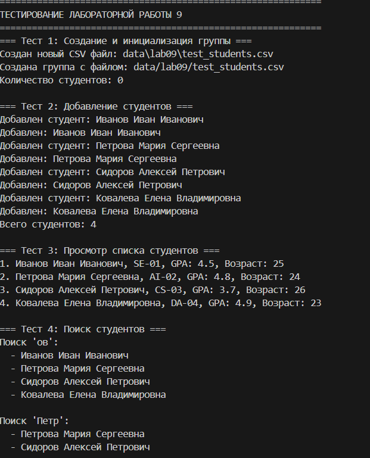

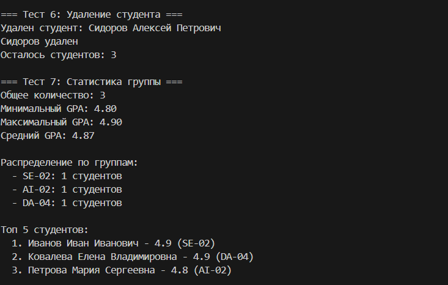

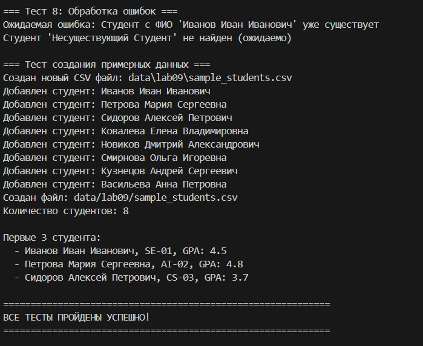


# Лабораторная работа 10

## Задание 1

```python
"""
Сравнение производительности различных структур данных.
"""

import time
from collections import deque
from src.lab10.structures import Stack, Queue
from src.lab10.linked_list import SinglyLinkedList


def benchmark_push_pop(n: int = 10000) -> None:
    """Сравнение операций push/pop для Stack и list."""
    print(f"\n=== Бенчмарк: push/pop для {n} элементов ===")
    
    # Тестирование Stack
    start = time.perf_counter()
    stack = Stack()
    for i in range(n):
        stack.push(i)
    for _ in range(n):
        stack.pop()
    stack_time = time.perf_counter() - start
    
    # Тестирование обычного списка
    start = time.perf_counter()
    lst = []
    for i in range(n):
        lst.append(i)
    for _ in range(n):
        lst.pop()
    list_time = time.perf_counter() - start
    
    print(f"Stack: {stack_time:.6f} секунд")
    print(f"list:  {list_time:.6f} секунд")
    print(f"Разница: {stack_time/list_time:.2f}x")


def benchmark_enqueue_dequeue(n: int = 10000) -> None:
    """Сравнение операций enqueue/dequeue для Queue, deque и list."""
    print(f"\n=== Бенчмарк: enqueue/dequeue для {n} элементов ===")
    
    # Тестирование Queue
    start = time.perf_counter()
    queue = Queue()
    for i in range(n):
        queue.enqueue(i)
    for _ in range(n):
        queue.dequeue()
    queue_time = time.perf_counter() - start
    
    # Тестирование deque
    start = time.perf_counter()
    dq = deque()
    for i in range(n):
        dq.append(i)
    for _ in range(n):
        dq.popleft()
    deque_time = time.perf_counter() - start
    
    # Тестирование обычного списка (неэффективно!)
    start = time.perf_counter()
    lst = []
    for i in range(n):
        lst.append(i)
    for _ in range(n):
        lst.pop(0)  # O(n) операция!
    list_time = time.perf_counter() - start
    
    print(f"Queue: {queue_time:.6f} секунд")
    print(f"deque: {deque_time:.6f} секунд")
    print(f"list:  {list_time:.6f} секунд (pop(0))")
    print(f"\nПримечание: list.pop(0) имеет сложность O(n), поэтому медленнее!")


def benchmark_linked_list_operations(n: int = 5000) -> None:
    """Сравнение операций для связного списка и обычного списка."""
    print(f"\n=== Бенчмарк: операции со списками для {n} элементов ===")
    
    # Тестирование вставки в начало
    print("\n1. Вставка в начало (prepend/insert(0, value)):")
    
    start = time.perf_counter()
    sll = SinglyLinkedList()
    for i in range(n):
        sll.prepend(i)
    sll_time = time.perf_counter() - start
    
    start = time.perf_counter()
    lst = []
    for i in range(n):
        lst.insert(0, i)  # O(n) операция!
    list_time = time.perf_counter() - start
    
    print(f"   SinglyLinkedList.prepend: {sll_time:.6f} секунд (O(1))")
    print(f"   list.insert(0, value):    {list_time:.6f} секунд (O(n))")
    print(f"   Разница: {list_time/sll_time:.2f}x")
    
    # Тестирование вставки в конец
    print("\n2. Вставка в конец (append):")
    
    start = time.perf_counter()
    sll.clear()
    for i in range(n):
        sll.append(i)
    sll_time = time.perf_counter() - start
    
    start = time.perf_counter()
    lst = []
    for i in range(n):
        lst.append(i)
    list_time = time.perf_counter() - start
    
    print(f"   SinglyLinkedList.append: {sll_time:.6f} секунд (O(1) с tail)")
    print(f"   list.append:             {list_time:.6f} секунд (O(1) в среднем)")
    
    # Тестирование доступа по индексу
    print("\n3. Доступ по индексу (get):")
    
    start = time.perf_counter()
    for i in range(min(n, 1000)):  # Меньше итераций, т.к. O(n) операция
        _ = sll.get(i)
    sll_time = time.perf_counter() - start
    
    start = time.perf_counter()
    for i in range(min(n, 1000)):
        _ = lst[i]
    list_time = time.perf_counter() - start
    
    print(f"   SinglyLinkedList.get: {sll_time:.6f} секунд (O(n))")
    print(f"   list[i]:              {list_time:.6f} секунд (O(1))")
    print(f"   Разница: {sll_time/list_time:.2f}x")


def benchmark_memory_usage() -> None:
    """Сравнение использования памяти."""
    print("\n=== Анализ использования памяти ===")
    print("\n1. Stack vs list:")
    print("   - Stack использует list внутри, поэтому память одинаковая")
    print("   - Плюс Stack: абстракция и защита от неправильного использования")
    
    print("\n2. Queue vs deque:")
    print("   - Queue использует deque внутри, поэтому память одинаковая")
    print("   - Плюс Queue: FIFO семантика, четкий API")
    
    print("\n3. SinglyLinkedList vs list:")
    print("   - SinglyLinkedList: больше памяти на узел (value + next pointer)")
    print("   - list: меньше памяти, т.к. хранит только значения в массиве")
    print("   - Обычно: список Python эффективнее по памяти в 2-3 раза")


def main():
    """Основная функция бенчмаркинга."""
    print("=" * 60)
    print("БЕНЧМАРКИНГ СТРУКТУР ДАННЫХ")
    print("=" * 60)
    
    # Размеры для тестов
    small_n = 1000
    medium_n = 10000
    large_n = 50000
    
    # Запуск бенчмарков
    benchmark_push_pop(small_n)
    benchmark_enqueue_dequeue(small_n)
    benchmark_linked_list_operations(small_n)
    benchmark_memory_usage()
    
    print("\n" + "=" * 60)
    print("ОСНОВНЫЕ ВЫВОДЫ:")
    print("=" * 60)
    print("""
1. Stack (на базе list):
   - Эффективность равна обычному списку
   - Плюс: чистая LIFO семантика, защита от ошибок

2. Queue (на базе deque):
   - deque уже оптимизирован для операций с двух сторон
   - НИКОГДА не используйте list.pop(0) для очереди!

3. SinglyLinkedList:
   - Быстрая вставка/удаление в начале (O(1))
   - Медленный доступ по индексу (O(n))
   - Больше памяти, чем у list
   - Полезен когда нужно часто вставлять/удалять в начале
   """)
    
    print("\nРЕКОМЕНДАЦИИ ПО ВЫБОРУ СТРУКТУРЫ:")
    print("""
1. Для LIFO (стек): используйте list или collections.deque
2. Для FIFO (очередь): ВСЕГДА используйте collections.deque
3. Для связного списка: используйте только если:
   - Часто вставляете/удаляете в начале
   - Не нужен доступ по индексу
   - Не критична память
4. В 95% случаев: обычный list или deque достаточно
    """)


if __name__ == "__main__":
    main()
```
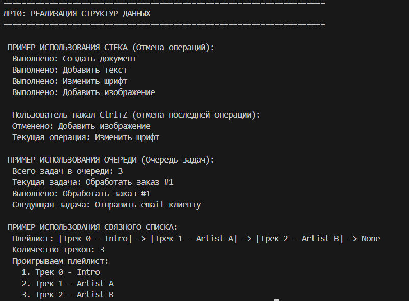

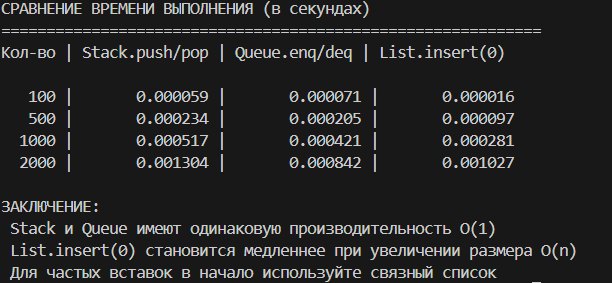

